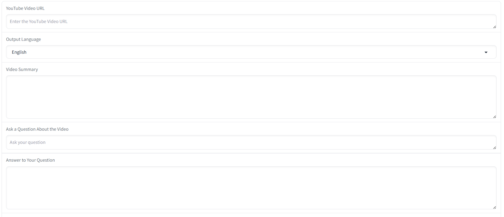
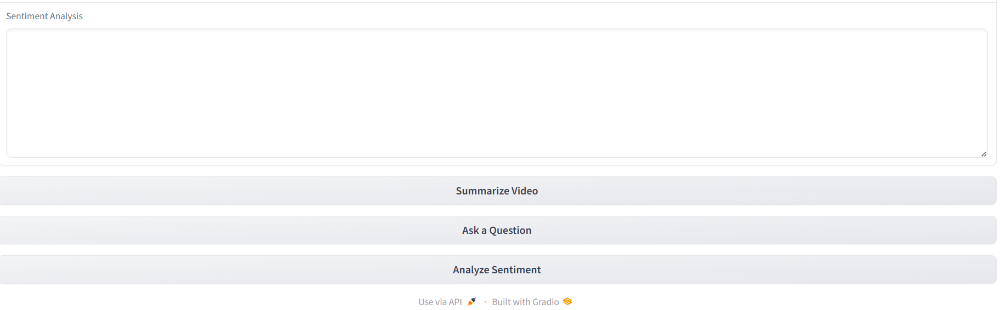

# AI YouTube Summarizer

An AI-powered web application that summarizes YouTube videos, answers questions about video content, performs transcript sentiment analysis, and supports multiple output languages using **Google Gemini**, **LangChain**, **FAISS**, and **Gradio**.

## Features

- 🎥 **YouTube Video Summarization** — Generates concise summaries from video transcripts.
- 💬 **Question Answering** — Ask natural-language questions about any supported YouTube video.
- 😊 **Sentiment Analysis** — Analyzes transcript sentiment with confidence, key emotions, and explanation.
- 🌍 **Multi-language Output** — Generate summaries, answers, and sentiment analysis in:
  - English
  - Hindi
  - Gujarati
  - Spanish
  - French
  - German
  - Japanese
- 🔄 **Transcript Fallback** — Automatically falls back to English or another available transcript when the selected language isn't available.

---

# Tech Stack

| Layer | Technology |
| --- | --- |
| UI | Gradio |
| LLM | Google Gemini 2.5 Flash |
| Framework | LangChain |
| Vector Database | FAISS |
| Embeddings | Google Generative AI Embeddings |
| Transcript API | youtube-transcript-api |
| Environment | python-dotenv |

---

# Installation

## Prerequisites

- Python 3.10+
- Google AI Studio API Key

## Clone Repository

```bash
git clone <your-github-repository-url>
cd AI-YOUTUBE-SUMMARIZER
```

## Create Virtual Environment

### Windows

```powershell
python -m venv my_env
.\my_env\Scripts\Activate.ps1
```

### macOS/Linux

```bash
python3 -m venv my_env
source my_env/bin/activate
```

## Install Dependencies

```bash
pip install -r requirements.txt
```

---

# Environment Variables

Create a `.env` file in the project root.

```env
GOOGLE_API_KEY=your_google_api_key
```

Alternatively,

### Windows

```powershell
$env:GOOGLE_API_KEY="your_google_api_key"
```

### macOS/Linux

```bash
export GOOGLE_API_KEY="your_google_api_key"
```

> Never commit your API key or `.env` file to GitHub.

---

# Run Locally

```bash
python app.py
```

Open

```
http://127.0.0.1:7860
```

Paste a YouTube URL and use any of the available features.

---

# Screenshots



*Input a video URL, choose the output language, and generate summaries or answers.*



*Review the generated summary, transcript sentiment, and question-answer results.*

---

# Deployment

## Deploy on Hugging Face Spaces

1. Create a new **Gradio Space** on Hugging Face.

2. Push the project files to the Space.

3. Add the following **Repository Secret**:

| Name | Value |
|------|------|
| GOOGLE_API_KEY | Your Google AI Studio API Key |

Go to:

```
Settings → Repository Secrets
```

Add

```
GOOGLE_API_KEY=<your_api_key>
```

4. Ensure the repository contains:

```
app.py
requirements.txt
README.md
```

5. Hugging Face will automatically build and deploy the application.

---

# Project Structure

```
AI-YOUTUBE-SUMMARIZER/
│
├── app.py
├── requirements.txt
├── README.md
├── .gitignore
└── .env (local only)
```

---

# Troubleshooting

### GOOGLE_API_KEY environment variable is not set

Add your API key to the `.env` file (local) or Repository Secrets (Hugging Face).

---

### Invalid YouTube URL

Use URLs in the format

```
https://www.youtube.com/watch?v=VIDEO_ID
```

---

### No transcript available

Some videos disable captions or do not provide transcripts.

---

### SSL Error while fetching transcript on Hugging Face

Some Hugging Face environments may experience SSL handshake issues when connecting to YouTube. The application works correctly when run locally. If this occurs, try another video or deploy the application on another hosting platform (e.g., Render or Railway).

---

# Future Improvements

- Support playlist summarization
- Export summaries as PDF
- Chat history
- Timestamp-based navigation
- Transcript download
- Multiple LLM support
- Video keyword extraction

---

# License

This project is intended for educational and learning purposes.